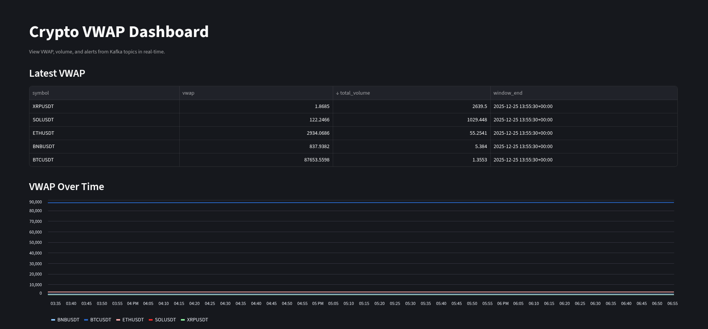
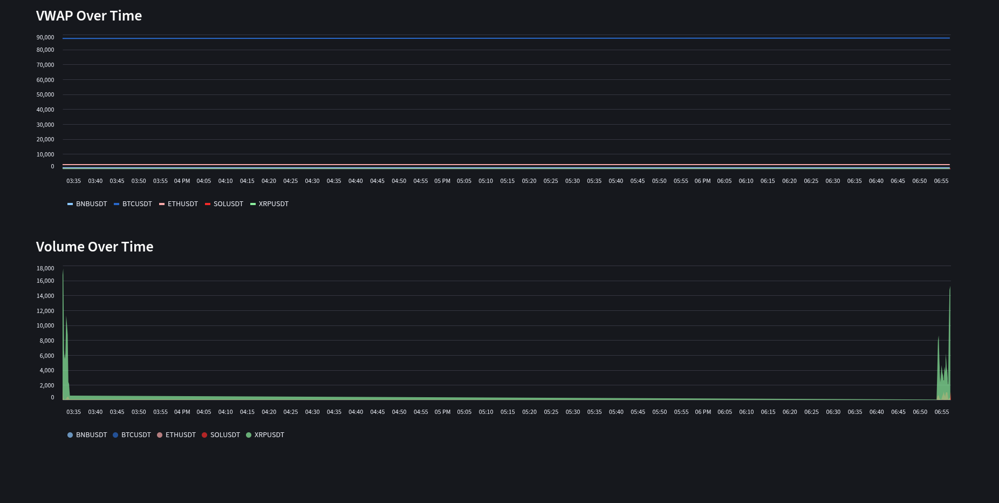
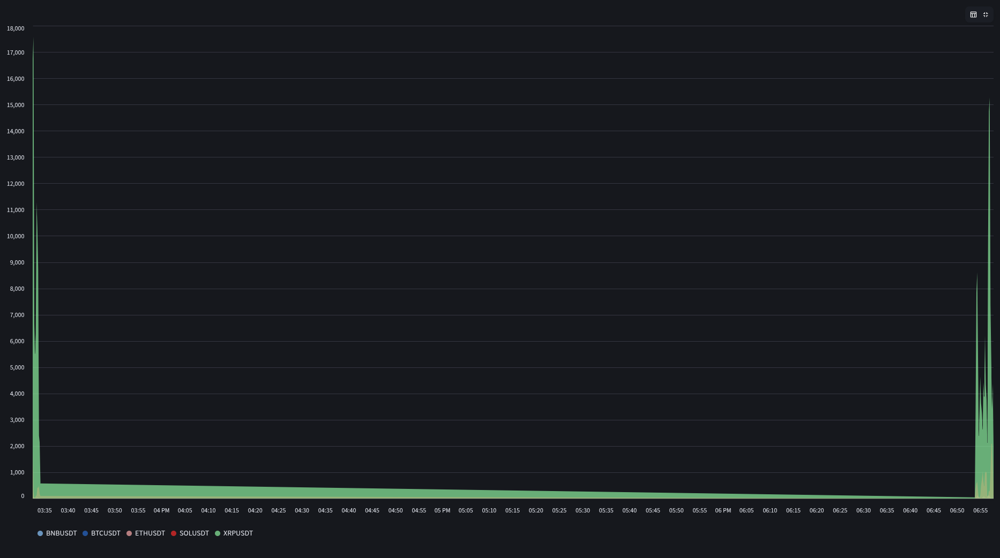

# CryptoTradeStream

CryptoTradeStream is a real-time cryptocurrency trading dashboard that provides users with live updates on market trends, price movements, and trading volumes. The project is designed to help traders make informed decisions by presenting data in an intuitive and visually appealing format.

## Launch/Deploy Instructions

1. **Clone the Repository**  
   Clone the project repository to your local machine:
   ```bash
   git clone https://github.com/Ahmad-Wali-i170106/CryptoTradeStream.git
   cd CryptoTradeStream
   ```

2. **Build Docker Images**  
   Ensure you have Docker installed on your system. Build each Docker image separately using the `docker build` command:

   **Build the Producer Image:**
   ```bash
   docker build -f producer/producer-dockerfile -t crypto_producer:latest ./producer
   ```

   **Build the Spark Processor Image:**
   ```bash
   docker build -f spark_processor/spark-processor-dockerfile -t crypto_spark_processor:latest ./spark_processor
   ```

   **Build the Dashboard Image:**
   ```bash
   docker build -f dashboard/dashboard-dockerfile -t crypto_dashboard:latest ./dashboard
   ```

3. **Run the Application**  
   Start the application using Docker Compose:
   ```bash
   docker-compose up
   ```

4. **Access the Dashboard**  
   Open your web browser and navigate to `http://localhost:8000` to view the dashboard.

5. **Install Dependencies (Optional for Local Development)**  
   If you want to run the application locally without Docker, ensure you have Python installed. Install the required dependencies:
   ```bash
   pip install uv
   uv sync
   ```

## Dashboard Images

Below are some screenshots of the CryptoTradeStream dashboard:






